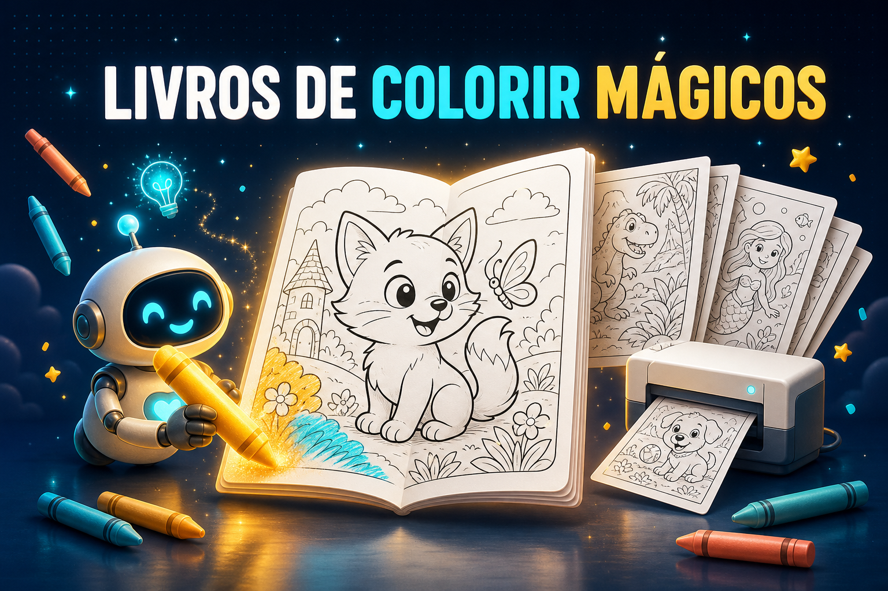
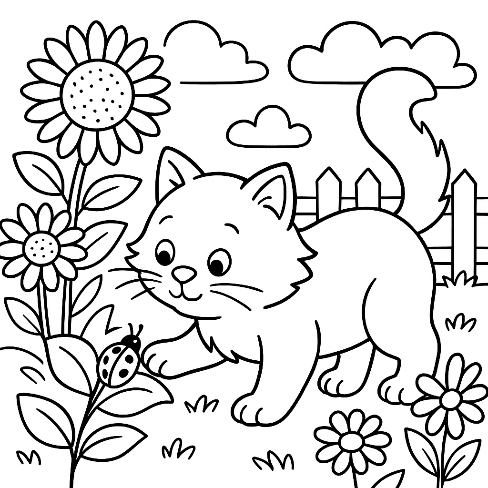
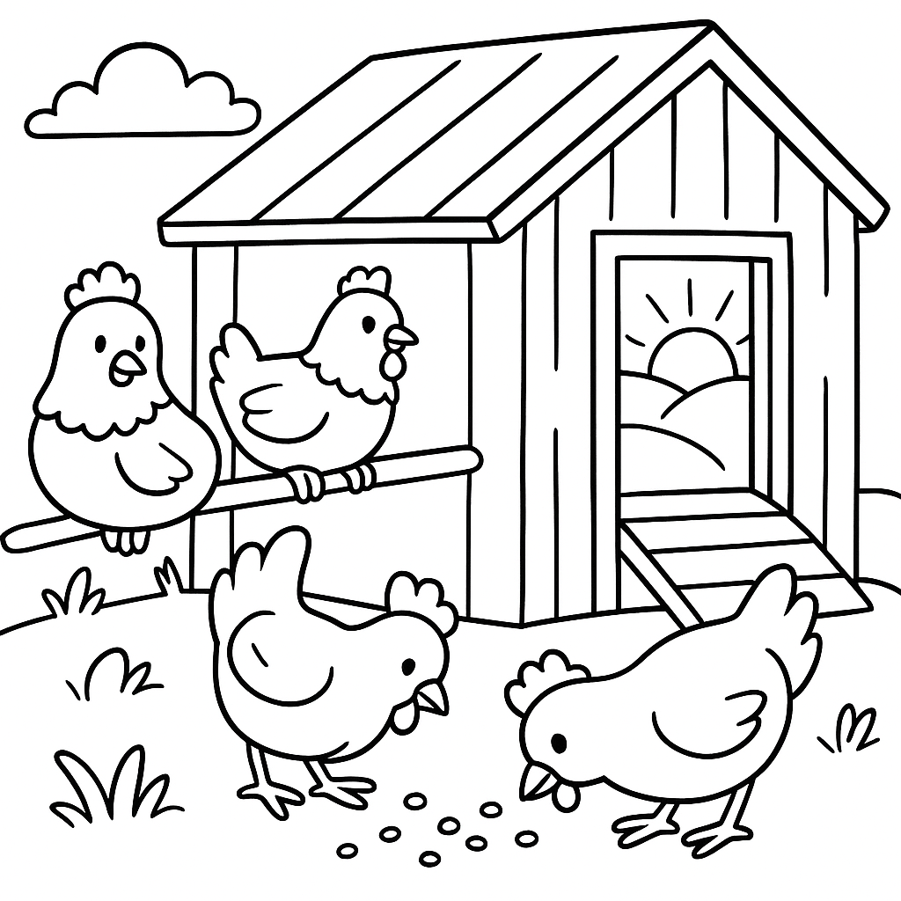

<p align="center">
  
</p>

<h1 align="center">🎨 Colorir Mágico</h1>
<p align="center">
  <strong>Agente de IA que cria livros de colorir personalizados para crianças.</strong><br>
  <em>Um modelo planeja as cenas; outro desenha cada página em line-art — pronto para imprimir e colorir.</em>
</p>

<p align="center">
  
  
  
  
  
  
</p>

---

## ✨ O que é

O **Colorir Mágico** é um agente que produz **livros de colorir inteiros** a partir de um tema.
Funciona em **dois modos**:

1. **Do zero** — você dá o tema (ex.: "animais da floresta") e a quantidade. A IA
   **planeja cenas variadas e criativas** (GLM) e **desenha cada página em line-art
   preto e branco** (OpenAI `gpt-image-1-mini`).
2. **De imagens** — você envia imagens/uma pasta e o agente **converte cada uma em
   line-art** para colorir (OpenAI image edit).

Tudo via uma **UI local no navegador** — sem instalar dependências (`npm install`).

## 🖼️ Amostras (geradas pelo agente)

<p float="left" align="center">
  
  &nbsp;
  
  &nbsp;
  
</p>

> Line-art nítido, traço limpo, pronto para imprimir e colorir.

## 🚀 Como usar

1. **Duplo-clique em `iniciar.bat`** (Windows).
   - Abre uma janela preta (deixe aberta) e o navegador em `http://localhost:4567`.
2. Digite o **tema** (ou clique num exemplo) e escolha **quantas imagens** (1 a 30).
3. Clique em **"Criar meu livro de colorir"**.
4. Acompanhe o progresso. Ao terminar, **a pasta abre sozinha** no Explorer com todas as imagens.

Para parar: feche a janela preta (ou `Ctrl+C`).

### Manual (qualquer SO)

```bash
git clone https://github.com/PedroMMGomes/agente-livros-colorir.git
cd agente-livros-colorir
# preencha .env (veja abaixo) e rode:
node server.mjs          # abre em http://localhost:4567
```

> **Zero dependências:** o servidor usa só módulos nativos do Node (≥ 18). Não precisa de `npm install`.

## 📁 Onde ficam as imagens

Cada livro vira uma pasta nova dentro de `livros/`:

```
livros/
  2026-06-21_1023_animais-da-floresta/
    01-urso-com-cesta.png
    02-raposa-na-caverna.png
    ...
    plano.json      # plano das cenas (gerado pela IA)
    relatorio.txt   # resumo do livro
```

## 🔧 Configuração (`.env`)

```ini
OPENAI_API_KEY=...
ZAI_API_KEY=...
OPENAI_IMAGE_MODEL=gpt-image-1-mini   # mude para gpt-image-2 p/ mais qualidade (~20x mais caro)
```

## 🧠 Modelos

| Componente | Modelo | Função |
|---|---|---|
| Planejamento criativo | GLM-4.6 (z.ai) | Cria o roteiro de cenas variadas |
| Geração de imagem | `gpt-image-1-mini` (OpenAI) | Desenha cada cena em line-art |

## 🗂️ Estrutura

```
agente-livros-colorir/
  server.mjs            # servidor HTTP (zero deps), modos 1 e 2
  iniciar.bat           # launcher Windows
  public/               # UI (HTML/CSS/JS servida no navegador)
  livros/               # saída (cada livro = uma pasta)  [gitignored]
  prompt-plano.txt      # prompt do diretor criativo (planejamento)
  comparativo-modelos/  # notas de comparação de modelos de imagem
  .env.example
```

## ✅ Requisitos

- **Node.js ≥ 18** (https://nodejs.org).
- Conexão com internet (chama as APIs).
- Chaves `OPENAI_API_KEY` e `ZAI_API_KEY` válidas.

## 🛠️ Resolução de problemas

- **"Node.js não encontrado"** → instale o Node.js 18+.
- **Página não abre** → confira se a janela preta está aberta; acesse `http://localhost:4567`.
- **Erro de chave** → edite `.env` com chaves válidas e reinicie.
- **Algumas imagens falharam** → normal (a IA pode errar uma ou outra); as que deram certo ficam na pasta.

## 🔒 Segurança

- `.env` **nunca** é commitado (no `.gitignore`).
- As saídas (`livros/`) também ficam de fora do git.

---

<sub>Capa gerada com OpenAI <code>gpt-image-2</code> (score 9 · clutter 4 · legibilidade 10). Line-art das amostras: OpenAI <code>gpt-image-1-mini</code>.</sub>
